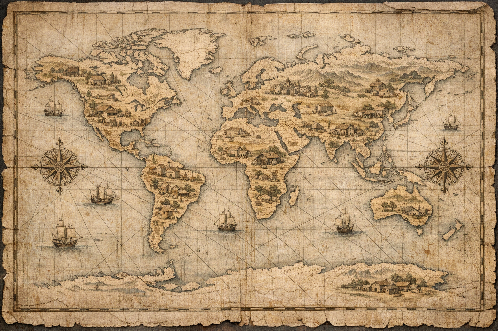

# 🌍 Uncovering-Oldest-Businesses-in-the-World

Some businesses manage to survive for centuries despite wars, political shifts, economic crises, and technological change. This project explores the **oldest continuously operating businesses in the world** using a cleaned dataset compiled by ***BusinessFinancing.co.uk***.

The analysis focuses on **combining multiple datasets using different types of join** to better understand the world's oldest businesses.

---

## 📂 Dataset Overview

`businesses.csv` and `new_businesses.csv`

|Column|Description|
|------|-----------|
|`business`|Name of the business (varchar)|
|`year_founded`|Year the business was founded (int)|
|`category_code`|Code for the business category (varchar)|
|`country_code`|ISO 3166-1 three-letter country code (char)|

`countries.csv`

|Column|Description|
|------|-----------|
|`country_code`|ISO 3166-1 three-letter country code (varchar)|
|`country`|Name of the country (varchar)|
|`continent`|Name of the continent the country exists in (varchar)|

`categories.csv`

|Column|Description|
|------|-----------|
|`category_code`|Code for the business category (varchar)|
|`category`|Description of the business category (varchar)|

---

## 🛠️ Tools Used

- Python  
- Pandas  
- CSV-based relational datasets  

---

## 🔍 Analysis Process

 **Data Integration**
- Business data was merged with country data using `country_code`
- Old and new business records were combined into a single dataset
- Business records were enriched with category descriptions

**Data Validation**
- Join integrity was enforced using `validate`
- Missing values were identified after merging
- Outer join was used to expose gaps in country coverage

**Data Analysis**
- Businesses were sorted by founding year
- Grouping and aggregation were used to identify oldest records
- Missing data counts were computed per continent

---

## 📊 Key Questions & Findings

**1. What is the oldest business on each continent?**

The oldest business per continent was identified by:
- Merging `businesses` and `countries` dataset on an inner join
- Grouping by `continent`
- Selecting the minimum founding year per group

The resulting dataset lists the **oldest continuously operating business in each continent**.

**2. How many countries per continent lack data on the oldest businesses?**

To identify missing records:
- `businesses` and `new_businesses` datasets were concatenated
- An outer join with country data revealed missing business entries
- Countries with no recorded businesses were counted per continent

This shows **how many countries in each continent lack data** on their oldest businesses, highlighting gaps in global business history coverage.

**3. What is oldest business category, and on which continent?**

Oldest business category was analyzed by:
- Joining `businesses` with both `countries` and `categories` datasets
- Grouping by continent and business category
- Identifying the earliest founding year per category
- Selecting the oldest category within each continent

The results indicate that **essential service categories** are the most resilient over long periods.

---

## 🧠 Conclusion

The analysis demonstrates that businesses capable of lasting centuries tend to:
- Serve essential and recurring human needs
- Be deeply embedded in cultural and regional traditions
- Adapt across major historical, political, and economic changes

By combining relational datasets and applying structured data analysis, this project provides insight into **what enables businesses to stand the test of time and where those conditions are most common**.
